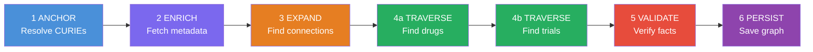
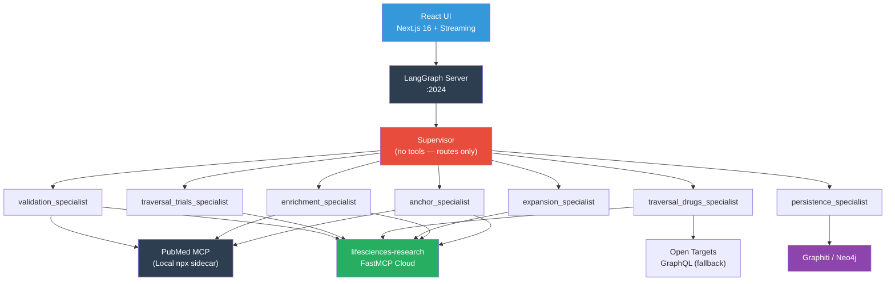

# Life Sciences Deep Agents 🧬🤖

> **Multi-agent orchestration for biomedical research — turning fuzzy questions into validated knowledge graphs.**

A [LangGraph](https://langchain-ai.github.io/langgraph/) + [DeepAgents](https://github.com/langchain-ai/deep-agents) platform that executes the **Fuzzy-to-Fact** protocol through a supervisor and 7 specialist subagents. Built on the [lifesciences-research](https://github.com/donbr/lifesciences-research) MCP API layer, deployed via [FastMCP Cloud](https://www.fastmcp.com/).

---

## Why This Exists

Researchers ask fuzzy questions — *"What drugs target the ACVR1 pathway in FOP?"* — but answering them rigorously requires traversing a dozen databases, resolving ambiguous names to canonical identifiers, cross-referencing drug mechanisms against clinical trial registries, and validating every claim against primary sources. Today this is manual, error-prone, and slow.

Large language models can orchestrate this traversal, but they hallucinate drug mechanisms, invent trial IDs, and conflate gene symbols. A bare LLM will confidently tell you a drug is "FDA-approved for FOP" when no such approval exists. The cost of a wrong answer in biomedicine is not a bad chatbot experience — it's wasted lab time, misleading grant applications, or worse.

This platform forces a **7-phase validation protocol** where every entity is resolved to a CURIE, every drug is looked up in ChEMBL or Open Targets, every trial ID is verified against ClinicalTrials.gov, and the final knowledge graph is persisted with full provenance. The vision: **every claim traceable to a canonical identifier, a database record, or a PubMed citation.**

---

## The Fuzzy-to-Fact Protocol

The protocol transforms a natural-language research question into a validated knowledge graph through 7 sequential phases. Each phase is handled by a dedicated specialist subagent with access to only the tools it needs.



| Phase | Specialist Subagent | Primary Databases | Output |
|:------|:-------------------|:------------------|:-------|
| **1. ANCHOR** | `anchor_specialist` | HGNC, ChEMBL, ClinicalTrials.gov, PubMed | Canonical CURIEs (e.g. `HGNC:171`, `CHEMBL:25`) |
| **2. ENRICH** | `enrichment_specialist` | HGNC, UniProt, ChEMBL, PubMed | Metadata: functions, Ensembl IDs, Max Phase |
| **3. EXPAND** | `expansion_specialist` | STRING, WikiPathways, BioGRID | Protein interactions, pathways, genetic links |
| **4a. TRAVERSE (Drugs)** | `traversal_drugs_specialist` | ChEMBL, Open Targets GraphQL | Drug candidates with mechanisms and phases |
| **4b. TRAVERSE (Trials)** | `traversal_trials_specialist` | ClinicalTrials.gov v2 | Active trials with NCT IDs |
| **5. VALIDATE** | `validation_specialist` | ClinicalTrials.gov, ChEMBL, PubMed | Each fact marked VALIDATED or INVALID |
| **6. PERSIST** | `persistence_specialist` | Graphiti / Neo4j | Knowledge graph with full provenance (OPTIONAL) |

---

## Architecture

This repo is the **agent orchestration layer**. It does not implement API clients directly — instead it calls the [lifesciences-research](https://github.com/donbr/lifesciences-research) MCP servers (12 databases, 34+ tools) via FastMCP Cloud, keeping the agent logic decoupled from API volatility.




### Key Files

```
apps/
├── api/
│   ├── graphs/
│   │   └── lifesciences.py        # Supervisor + 7 subagents via create_deep_agent()
│   └── shared/
│       ├── mcp.py                  # HTTPMCPClient, 5 tool wrappers, rate limiter
│       ├── prompts.py              # System prompts for all 7 phase specialists
│       └── tools.py                # tavily_search, think_tool
└── web/
    └── src/
        ├── app/hooks/useChat.ts    # Core chat state, streaming, interrupt handling
        └── providers/              # ClientProvider, ChatProvider
langgraph.json                      # Graph entry points
.mcp.json                           # MCP server registry (Graphiti, Neo4j)
```

---

## Key Features

- **Supervisor + 7 specialist subagents** via `create_deep_agent()` — the supervisor has no tools; it only routes
- **Think-Act-Observe reasoning loops** — `think_tool` forces deliberate reflection after every API call
- **Tool isolation** — each specialist only gets the tools relevant to its phase
- **Per-service rate limiting** — STRING 1 req/s, ChEMBL 0.5s, PubMed 0.34s, BioGRID 0.5s
- **ChEMBL → Open Targets automatic fallback** — when ChEMBL returns 500 errors (common), the drug traversal specialist falls back to Open Targets GraphQL
- **Real-time subagent visualization** — the streaming React UI shows which specialist is active, which tools are being called, and intermediate results
- **Tool approval interrupts** — checkpoint/resume support for human-in-the-loop review
- **Knowledge graph persistence** — validated graphs saved to Graphiti (backed by Neo4j) with full provenance metadata

---

## MCP Tool Wrappers

All external API access flows through 5 tool wrappers defined in `shared/mcp.py`:

| Tool | Endpoint | Timeout | Purpose |
|:-----|:---------|:--------|:--------|
| `query_lifesciences` | `lifesciences-research.fastmcp.app/mcp` | 120s | 12 databases: ChEMBL, HGNC, UniProt, STRING, BioGRID, ClinicalTrials.gov, Open Targets, PubChem, WikiPathways, Ensembl, Entrez, IUPHAR |
| `query_pubmed` | `npx @cyanheads/pubmed-mcp-server` (local) | 60s | PubMed article search, metadata, full text |
| `query_langchain_docs` | `docs.langchain.com/mcp` | 30s | LangChain/LangGraph documentation lookup |
| `query_api_direct` | *(arbitrary URL)* | 30s | Direct HTTP GET/POST fallback (Open Targets GraphQL, ClinicalTrials.gov v2) |
| `persist_to_graphiti` | `localhost:8000/mcp` | 30s | Save knowledge graph as JSON episodes to Graphiti |

The `query_lifesciences` tool accepts a `tool_args` parameter for full API control:

```python
# Resolve a gene
query_lifesciences(query="ACVR1", tool_name="hgnc_search_genes")

# Get interactions by ID
query_lifesciences(query="", tool_name="biogrid_get_interactions", tool_args={"gene_symbol": "ACVR1"})
```

---

## Quick Start

### Prerequisites

- Python 3.11+, [uv](https://docs.astral.sh/uv/)
- Node.js 18+, [yarn](https://yarnpkg.com/) (Required for frontend AND backend PubMed integration)

### 1. Clone and Configure

```bash
git clone https://github.com/donbr/lifesciences-deepagents.git
cd lifesciences-deepagents
cp .env.example .env
# Edit .env with your API keys (see Configuration below)
```

### 2. Start the Backend

```bash
uv sync
uv run langgraph dev
```

> **Note:** The first request to PubMed may take a moment while `npx` downloads the `@cyanheads/pubmed-mcp-server` package.

The LangGraph API serves at `http://localhost:2024`.

### 3. Start the Frontend

```bash
cd apps/web
yarn install
yarn dev
```

Open `http://localhost:3000`. Select the **lifesciences** assistant in UI Settings to begin.

---

## Example Walkthrough: Drug Repurposing for FOP

> *"What drugs target the ACVR1 pathway in fibrodysplasia ossificans progressiva (FOP)?"*

Here's what happens when the 7-phase protocol processes this question:

**Phase 1 — ANCHOR:** The anchor specialist searches HGNC and resolves "ACVR1" to `HGNC:171` (Activin A Receptor Type 1). It identifies FOP as the disease context.

**Phase 2 — ENRICH:** The enrichment specialist fetches UniProt entry `Q04771` for ACVR1, revealing it's a BMP type-1 receptor serine/threonine kinase. It retrieves the Ensembl ID `ENSG00000115170` for cross-referencing.

**Phase 3 — EXPAND:** The expansion specialist queries STRING for protein-protein interactions (BMPR2, SMAD1, SMAD5) and WikiPathways for BMP signaling pathway membership.

**Phase 4a — TRAVERSE (Drugs):** The drug specialist searches Open Targets using Ensembl ID `ENSG00000115170` and finds **Palovarotene** (retinoic acid receptor gamma agonist, Phase 3) and **Garetosmab** (anti-activin A antibody).

**Phase 4b — TRAVERSE (Trials):** The trial specialist searches ClinicalTrials.gov for "Palovarotene AND fibrodysplasia ossificans progressiva" and finds **NCT03312634** (MOVE trial, Phase 3, Ipsen).

**Phase 5 — VALIDATE:** The validation specialist verifies NCT03312634 exists and confirms Palovarotene's mechanism against PubMed literature. Each fact is marked VALIDATED.

**Phase 6 — PERSIST:** The persistence specialist structures the validated knowledge graph (nodes: ACVR1, Palovarotene, FOP; edges: TARGETS, TREATS, REGISTERED_FOR) and saves it to Graphiti with full provenance.

The result: a traceable chain from fuzzy question to validated knowledge graph — `HGNC:171` → `ENSG00000115170` → Palovarotene → `NCT03312634` — with every link backed by a database record.

---

## Configuration

### Environment Variables

Required in `.env` (see `.env.example`):

| Variable | Purpose | Required |
|:---------|:--------|:---------|
| `NEO4J_URI` | Neo4j connection (e.g. `bolt://localhost:7687`) | For PERSIST phase |
| `NEO4J_USER` | Neo4j username | For PERSIST phase |
| `NEO4J_PASSWORD` | Neo4j password | For PERSIST phase |
| `LANGSMITH_API_KEY` | LangSmith tracing key | For observability |
| `LANGSMITH_TRACING` | Enable tracing (`true`) | For observability |
| `LANGSMITH_PROJECT` | LangSmith project name | For observability |
| `BIOGRID_API_KEY` | BioGRID API key ([free registration](https://thebiogrid.org/)) | For EXPAND phase |
| `NCBI_API_KEY` | NCBI Entrez API key ([free registration](https://account.ncbi.nlm.nih.gov/settings/)) | For PubMed lookups |
| `ANTHROPIC_API_KEY` | Anthropic API key | Runtime (model provider) |
| `OPENAI_API_KEY` | OpenAI API key | Runtime (default model) |
| `TAVILY_API_KEY` | Tavily search API key | For web search fallback |

### Config Files

| File | Purpose |
|:-----|:--------|
| `langgraph.json` | Graph entry points — maps `lifesciences`, `research`, `coding` to Python files |
| `.mcp.json` | MCP server registry (Graphiti, Neo4j Aura/Docker) |
| `pyproject.toml` | Python dependencies (uv-managed) |
| `apps/web/package.json` | Frontend dependencies (yarn-managed) |

---

## Tech Stack

### Backend

| Component | Version | Role |
|:----------|:--------|:-----|
| Python | 3.11+ | Runtime |
| [uv](https://docs.astral.sh/uv/) | Latest | Package manager |
| [DeepAgents](https://github.com/langchain-ai/deep-agents) | >=0.3.1 | Supervisor + subagent framework |
| [LangGraph](https://langchain-ai.github.io/langgraph/) | Latest | Agent state machine, checkpointing |
| [LangChain](https://python.langchain.com/) | >=1.2.0 | Model abstraction, tool definitions |
| [MCP](https://modelcontextprotocol.io/) | >=1.25.0 | Model Context Protocol client |
| [Neo4j](https://neo4j.com/) | >=6.0.3 | Graph database (Graphiti backend) |
| [Anthropic SDK](https://docs.anthropic.com/) | >=0.75.0 | Claude model access |

### Frontend

| Component | Version | Role |
|:----------|:--------|:-----|
| [Next.js](https://nextjs.org/) | 16 | React framework (Turbopack) |
| [React](https://react.dev/) | 19.1 | UI library |
| [TypeScript](https://www.typescriptlang.org/) | 5.9+ | Type safety |
| [Tailwind CSS](https://tailwindcss.com/) | 3.4 | Styling |
| [Radix UI](https://www.radix-ui.com/) | Latest | Accessible component primitives |
| [@langchain/langgraph-sdk](https://www.npmjs.com/package/@langchain/langgraph-sdk) | >=1.0.3 | LangGraph streaming client |
| [nuqs](https://nuqs.47ng.com/) | 2.4 | URL query state (thread IDs) |

---

## Ecosystem: Three Approaches to Fuzzy-to-Fact

This repository is **one of three implementations** of the Fuzzy-to-Fact protocol. Each takes a different architectural approach, and all three share the same [lifesciences-research](https://github.com/donbr/lifesciences-research) MCP API layer as their data backbone.

| | Claude Code Skills (prototype) | **Deep Agents (this repo)** | [Temporal Workflows](https://github.com/donbr/lifesciences-temporal) |
|:---|:---|:---|:---|
| **Pattern** | CLI skill scripts (`.claude/skills/`) | LangGraph supervisor + 7 subagents | PydanticAI agents + Temporal activities |
| **Orchestration** | Claude Code routes to skills | `create_deep_agent()` supervisor | Temporal workflow engine |
| **Durability** | Session-scoped | Thread checkpoints (LangGraph) | Temporal workflow history (survives crashes) |
| **UI** | Terminal (Claude Code CLI) | Streaming React chat | None (API-first) |
| **Best for** | Rapid prototyping, exploring APIs | Interactive research sessions | Production batch pipelines |
| **Reasoning** | Single-turn skill execution | Think-Act-Observe loops per phase | Structured activity retries |

> The **Claude Code Skills** prototype (the `.claude/skills/` directory in this repo) was the initial implementation — 6 skills covering genomics, proteomics, pharmacology, clinical trials, CRISPR validation, and graph building. It proved the protocol worked but lacked persistence, streaming UI, and multi-phase orchestration. This repo evolved that prototype into a proper multi-agent system.

All three depend on **[lifesciences-research](https://github.com/donbr/lifesciences-research)** — 12 MCP servers wrapping HGNC, UniProt, ChEMBL, Open Targets, STRING, BioGRID, IUPHAR, PubChem, WikiPathways, ClinicalTrials.gov, Ensembl, and Entrez.

---

## Acknowledgements

### Upstream Databases

This platform queries public APIs maintained by rigorous scientific institutions. We gratefully acknowledge their contributions:

| Database | Institution | Link |
|:---------|:-----------|:-----|
| HGNC | HUGO Gene Nomenclature Committee, EMBL-EBI | [genenames.org](https://www.genenames.org/) |
| UniProt | UniProt Consortium | [uniprot.org](https://www.uniprot.org/) |
| ChEMBL | European Bioinformatics Institute (EMBL-EBI) | [ebi.ac.uk/chembl](https://www.ebi.ac.uk/chembl/) |
| Open Targets | EMBL-EBI, Wellcome Sanger Institute, GSK | [platform.opentargets.org](https://platform.opentargets.org/) |
| STRING | STRING Consortium | [string-db.org](https://string-db.org/) |
| BioGRID | Tyers Lab, University of Montreal | [thebiogrid.org](https://thebiogrid.org/) |
| IUPHAR/GtoPdb | International Union of Basic and Clinical Pharmacology | [guidetopharmacology.org](https://www.guidetopharmacology.org/) |
| PubChem | National Center for Biotechnology Information (NCBI) | [pubchem.ncbi.nlm.nih.gov](https://pubchem.ncbi.nlm.nih.gov/) |
| WikiPathways | WikiPathways Community | [wikipathways.org](https://www.wikipathways.org/) |
| ClinicalTrials.gov | U.S. National Library of Medicine | [clinicaltrials.gov](https://clinicaltrials.gov/) |
| Ensembl | EMBL-EBI | [ensembl.org](https://www.ensembl.org/) |
| NCBI Gene | National Center for Biotechnology Information | [ncbi.nlm.nih.gov/gene](https://www.ncbi.nlm.nih.gov/gene) |
| PubMed | National Library of Medicine | [pubmed.ncbi.nlm.nih.gov](https://pubmed.ncbi.nlm.nih.gov/) |

### Built With

- [LangGraph](https://langchain-ai.github.io/langgraph/) — Agent state machine and checkpointing
- [DeepAgents](https://github.com/langchain-ai/deep-agents) — Supervisor + subagent framework
- [FastMCP](https://www.fastmcp.com/) — MCP server deployment platform
- [Model Context Protocol](https://modelcontextprotocol.io/) — Anthropic's open standard for tool integration
- [Graphiti](https://github.com/getzep/graphiti) (Zep) — Temporal knowledge graph memory

---

## References

- [DeepAgents — LangChain](https://github.com/langchain-ai/deep-agents)
- [LangGraph Documentation](https://langchain-ai.github.io/langgraph/)
- [Model Context Protocol Specification](https://modelcontextprotocol.io/)
- [FastMCP Cloud](https://www.fastmcp.com/)
- [lifesciences-research](https://github.com/donbr/lifesciences-research) — The MCP API layer (12 servers, 34+ tools)
- [lifesciences-temporal](https://github.com/donbr/lifesciences-temporal) — Durable workflow implementation (PydanticAI + Temporal.io)

---

## License

MIT
