# Session 7: Deep Agents

## Slide Deck for AIE9 Bootcamp

---

## Slide 1: Title

### Content
# Deep Agents
## Building Agents for Complex, Long-Horizon Tasks

**Session 7 | AI Engineering Bootcamp Cohort 9**

### Visual
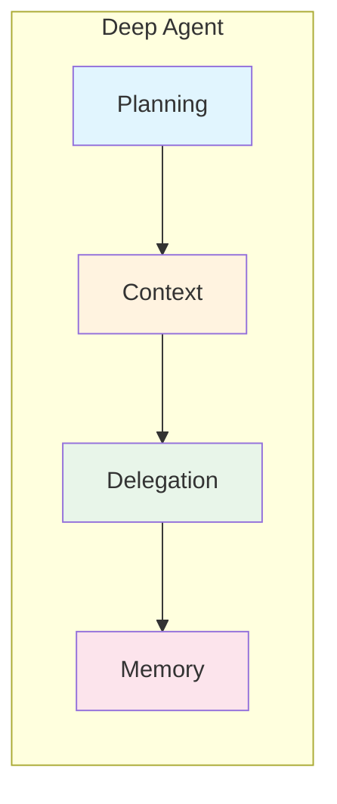

### Speaker Notes
Welcome to Session 7 on Deep Agents. Today we'll learn how to build agents that can handle complex, multi-step tasks over longer time horizons. This builds on everything we've learned about agents, multi-agent systems, and memory.

---

## Slide 2: Learning Objectives

### Content
## By the End of This Session

1. **Explain** when to use Deep Agents vs. simple agents
2. **Identify** the four key elements of Deep Agents
3. **Implement** task planning with TodoListMiddleware
4. **Use** FilesystemMiddleware for context management
5. **Spawn** subagents for context isolation
6. **Configure** persistent memory with LangGraph Store
7. **Create** skill.md files for dynamic capability loading

### Visual
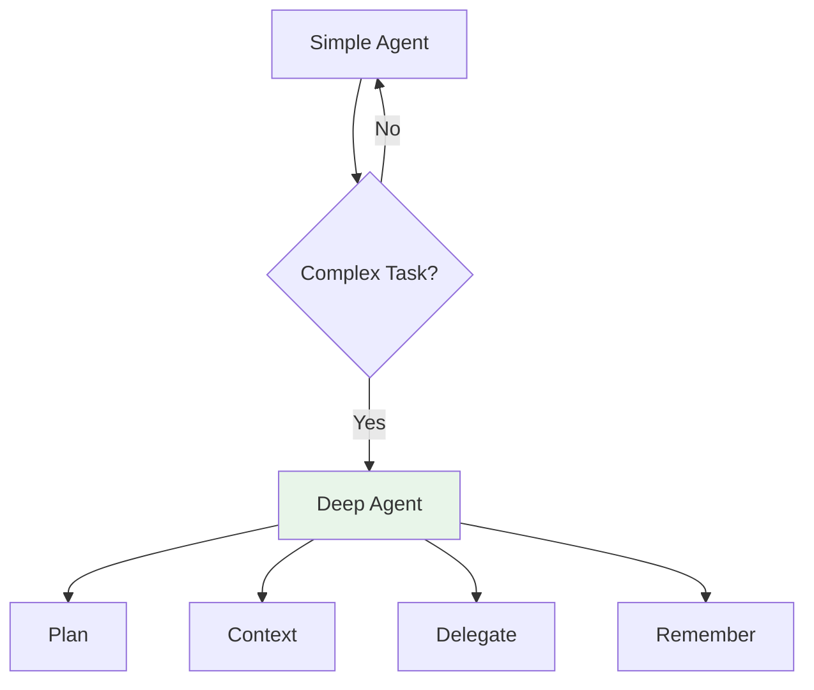

### Speaker Notes
These are our learning objectives. Notice we're building on Session 3 (Agent Loop), Session 5 (Multi-Agent), and Session 6 (Memory). Deep Agents integrate all these concepts into a cohesive framework.

---

## Slide 3: What are Deep Agents?

### Content
## Beyond Simple Tool-Calling Loops

> "Deep agents are LLM-based systems that excel at complex, long-horizon tasks by moving beyond simple tool-calling loops into more sophisticated architectures."
> — LangChain Blog

**Built on LangGraph, inspired by:**
- Claude Code (Anthropic)
- Deep Research (OpenAI)
- Manus (startup)

### Visual
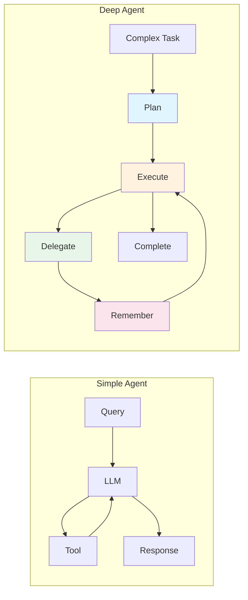

### Speaker Notes
The key insight is that simple agents work great for simple tasks, but complex tasks need more sophisticated approaches. Deep agents add planning, context management, delegation, and memory to handle longer time horizons.

---

## Slide 4: When to Use What

### Content
## Agent Selection Decision Tree

| Scenario | Solution |
|----------|----------|
| Simple, single-turn task | `create_agent()` |
| Custom workflow logic needed | LangGraph (build from scratch) |
| Complex, multi-step, long-running | `create_deep_agent()` |

### Visual
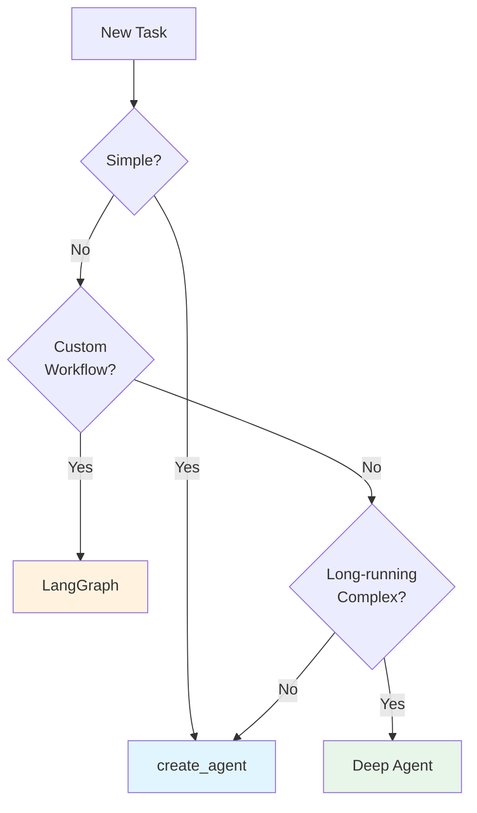

### Speaker Notes
This is the decision framework. Simple tasks: use create_agent. Need custom control flow: use LangGraph directly. Complex, long-running tasks with planning needs: use Deep Agents. Deep Agents is built on LangGraph, so it's not either/or—it's about picking the right level of abstraction.

---

## Slide 5: The Four Elements

### Content
## Foundational Architecture

1. **Detailed System Prompt** - Instructions with examples
2. **Planning Tool** - `write_todos` for task decomposition
3. **Sub-agents** - Spawn specialized agents
4. **File System** - Context management & memory

### Visual
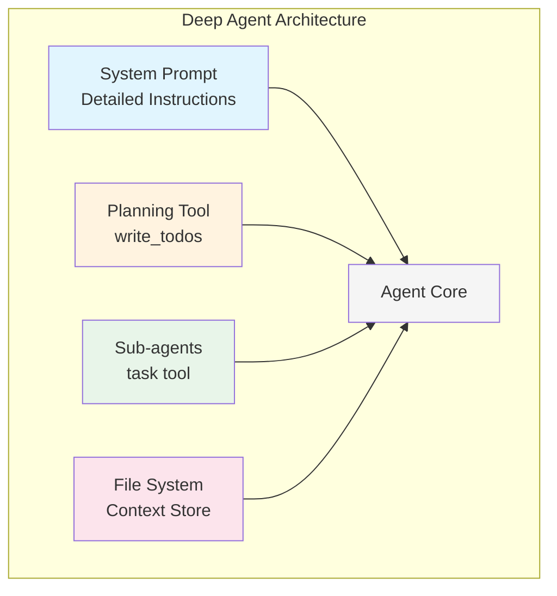

### Speaker Notes
These four elements are what distinguish deep agents from simple agents. Each one solves a specific problem: system prompts guide behavior, planning maintains focus, subagents handle context bloat, and the filesystem stores data. Let's explore each one. (Notebook reference: `0_create_agent.ipynb` establishes the baseline agent architecture.)

---

## Slide 6: Planning and Task Decomposition

### Content
## TodoListMiddleware

**The `write_todos` tool enables:**
- Break complex tasks into steps
- Track progress through execution
- Adapt plans as new information emerges

**Key Insight:** The todo list is a "no-op" tool—it doesn't execute actions but provides **context engineering** that helps maintain focus.

### Visual
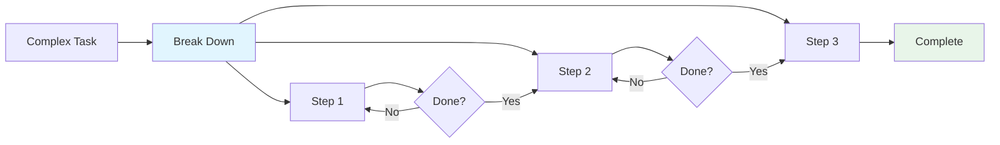

### Speaker Notes
The planning tool is interesting because it's essentially a "no-op"—it doesn't do anything functional. But by forcing the agent to articulate its plan, we provide context engineering that keeps the agent focused across long tasks. This is similar to how humans use todo lists. (Notebook reference: `1_todo.ipynb` implements the TodoListMiddleware and `write_todos` tool.)

---

## Slide 7: Context Management with Filesystem

### Content
## FilesystemMiddleware

> "The key design principle behind the Claude Agent SDK is to give your agents a computer, allowing them to work like humans do."
> — Anthropic Engineering

**Available Tools:**
| Tool | Purpose |
|------|---------|
| `ls` | List files |
| `read_file` | Read contents |
| `write_file` | Store data |
| `edit_file` | Modify existing |

### Visual
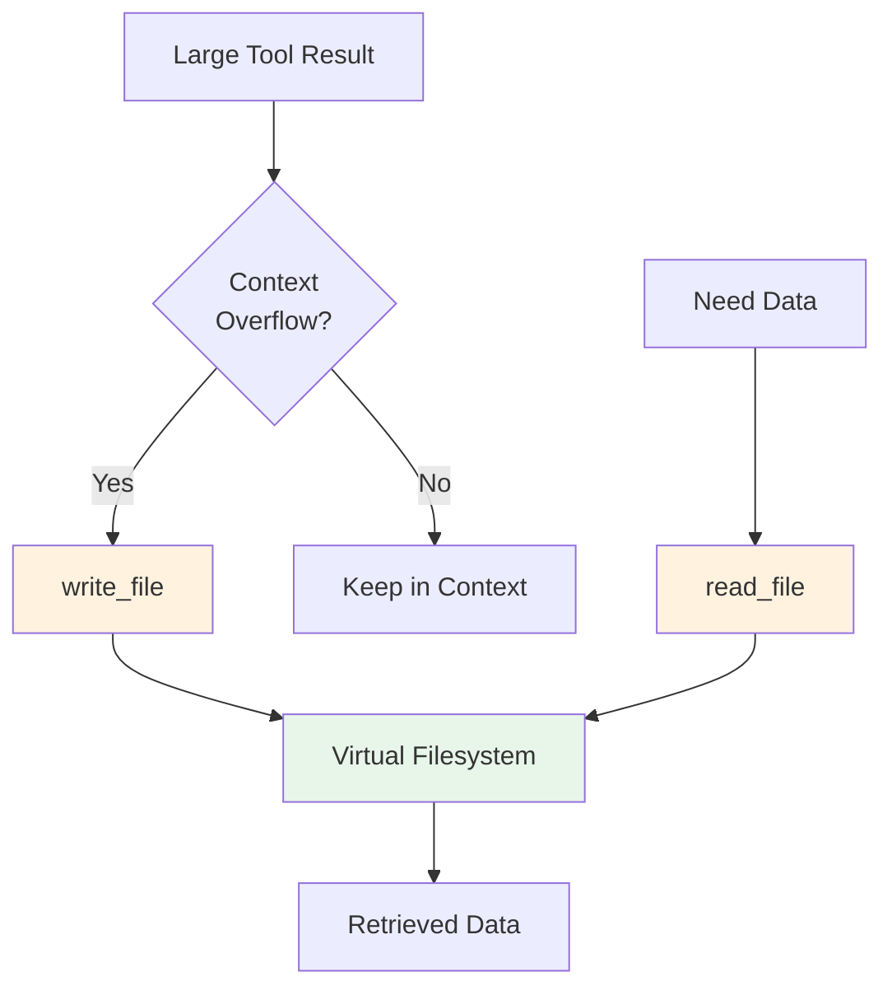

### Speaker Notes
The filesystem is how agents manage context overflow. When tools return large results, instead of keeping everything in the context window, the agent can write data to files and read it back when needed. This mimics how humans use notes and documents. (Notebook reference: `2_files.ipynb` implements the FilesystemMiddleware with virtual file operations.)

---

## Slide 8: Subagent Spawning

### Content
## SubAgentMiddleware & Context Quarantine

> "Subagents solve the context bloat problem. When agents use tools with large outputs, the context window fills up quickly with intermediate results."
> — LangChain Docs

**The `task` tool spawns isolated agents** that:
- Work with their own context
- Return only summarized results
- Keep main agent's context clean

### Visual
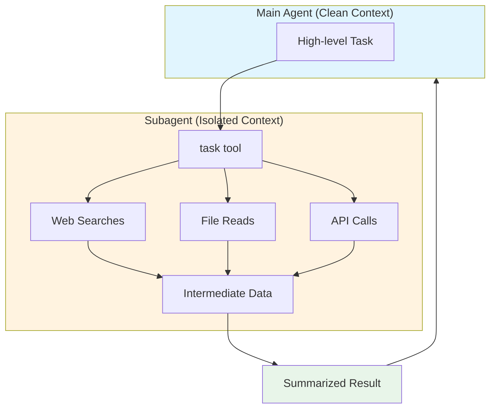

### Speaker Notes
This is context quarantine. The subagent does all the messy work—web searches, file reads, API calls—and accumulates lots of intermediate data. But only the summarized result comes back to the main agent. This keeps the main agent's context clean and focused. (Notebook reference: `3_subagents.ipynb` implements the SubAgentMiddleware and `task` tool for context isolation.)

---

## Slide 9: Long-term Memory

### Content
## Persistent Storage Across Threads

**Default behavior:** Filesystem is transient (single thread)

**With CompositeBackend:**
- `/memories/*` → Persistent Store (across threads)
- Other paths → Ephemeral State (single thread)

**Store Options:**
- InMemoryStore (dev)
- Redis Store (prod)
- Custom backends (databases)

### Visual
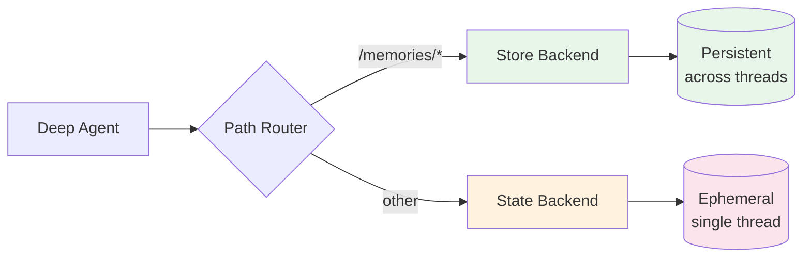

### Speaker Notes
By default, the filesystem is stored in agent state and lost when the thread ends. But you can configure a CompositeBackend that routes certain paths to persistent storage. This enables agents to remember things across conversations—like user preferences or learned patterns.

---

## Slide 10: Middleware Architecture

### Content
## Modular, Composable Design

```python
from deepagents import create_deep_agent

# Automatically attaches:
# - TodoListMiddleware
# - FilesystemMiddleware
# - SubAgentMiddleware

agent = create_deep_agent(model="gpt-4o")
```

**Middleware is composable**—add/remove as needed.

### Visual
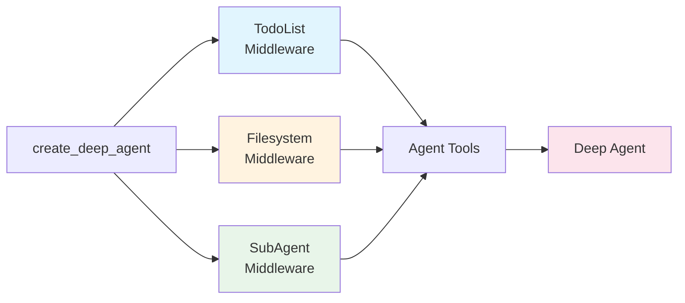

### Speaker Notes
The middleware architecture is what makes Deep Agents modular. When you call create_deep_agent, it automatically attaches the three core middleware components. But you can customize this—add your own middleware or remove ones you don't need.

---

## Slide 11: Skills: Dynamic Capability Loading

### Content
## Progressive Disclosure for Capabilities

> "Skills are simply folders containing a SKILL.md file along with any associated files that agents can discover and load dynamically."
> — LangChain Blog

**Structure:**
```
~/.deepagents/agent/skills/
└── my-skill/
    ├── SKILL.md
    └── resources/
```

### Visual
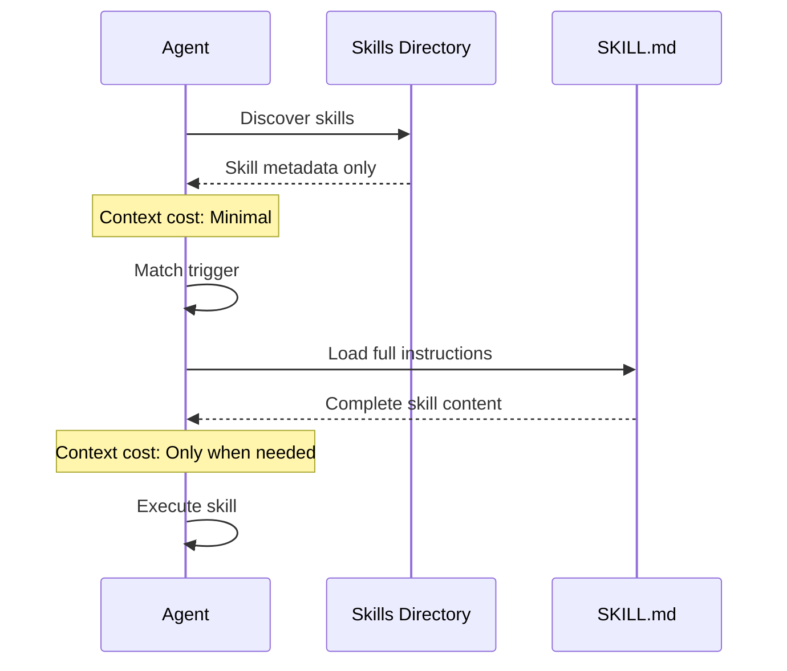

### Speaker Notes
Skills use progressive disclosure. The agent first sees only metadata—name and triggers. When a user request matches a trigger, the agent loads the full SKILL.md instructions. This keeps context lean until capabilities are actually needed.

---

## Slide 12: The Deep Agents CLI

### Content
## Terminal-Based Agent Assistant

**Capabilities:**
- File operations (read, write, edit)
- Shell execution (tests, builds, git)
- Web search (Tavily integration)
- HTTP requests (API calls)
- Task planning (todos)
- Memory (cross-session)
- Human-in-the-loop (approvals)

```bash
pip install deepagents-cli
deepagents
```

### Visual
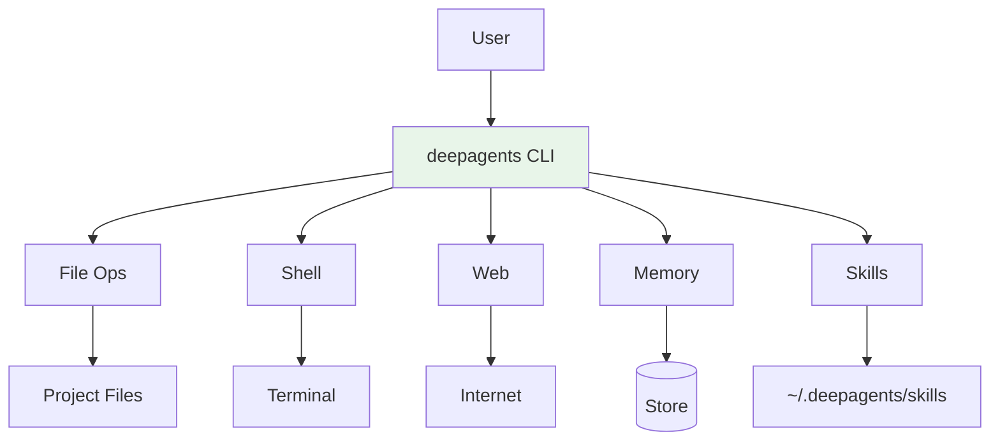

### Speaker Notes
The Deep Agents CLI is a ready-to-use implementation of all these concepts. It's like having Claude Code but built on LangGraph with customizable skills. You can extend it with your own skills and configure its behavior.

---

## Slide 13: Production Patterns

### Content
## Deploying Deep Agents

**Backend Selection:**
| Environment | Recommended |
|-------------|-------------|
| Development | InMemoryStore |
| Testing | SQLite Store |
| Production | Redis / PostgreSQL |

**Token Management (DeepAgents 0.2):**
- Large tool result eviction
- Conversation summarization
- Dangling tool call repair

### Visual
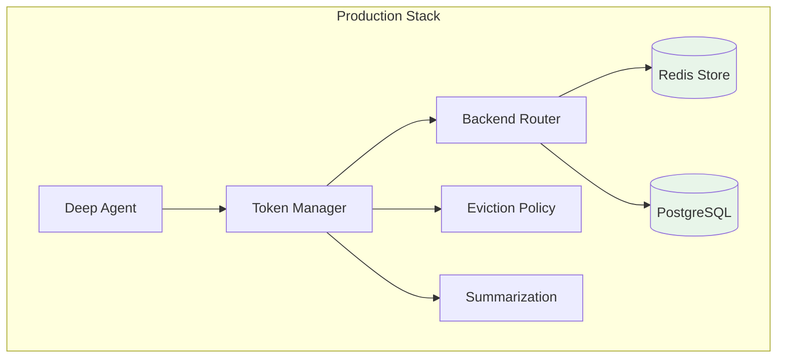

### Speaker Notes
In production, you need proper backends for persistence and token management strategies to handle long-running tasks. DeepAgents 0.2 added automatic eviction of large tool results and conversation summarization to manage context limits.

---

## Slide 14: Demo - Building a Deep Agent

### Content
## Live Implementation: deep-agents-from-scratch

| Notebook | Concept | Builds On |
|----------|---------|-----------|
| `0_create_agent.ipynb` | Basic ReAct agent (baseline) | — |
| `1_todo.ipynb` | Task planning with `write_todos` | Notebook 0 |
| `2_files.ipynb` | Virtual filesystem operations | Notebook 1 |
| `3_subagents.ipynb` | Context isolation through delegation | Notebook 2 |
| `4_full_agent.ipynb` | Full production research agent | All previous |

### Visual
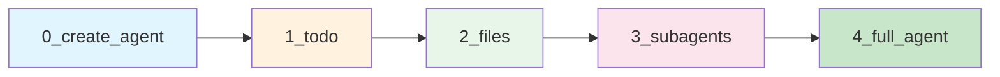

### Speaker Notes
The demo follows the deep-agents-from-scratch repository notebooks. Each notebook builds incrementally: start with a basic ReAct agent (0), add planning (1), add filesystem (2), add subagents (3), then see everything combined in a production research agent (4). This mirrors how you'd build a real deep agent.

---

## Slide 15: Summary

### Content
## Key Takeaways

1. **Deep Agents** = Planning + Context + Delegation + Memory
2. **Four Elements**: System prompt, todos, subagents, filesystem
3. **Context Quarantine** solves context bloat via subagents
4. **Skills** enable progressive disclosure of capabilities
5. **Production** requires proper backends and token management

**Remember:** Use Deep Agents when tasks are complex and long-running. For simple tasks, `create_agent()` is still the right choice.

### Visual
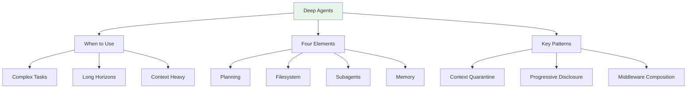

### Speaker Notes
To summarize: Deep Agents extend the agent loop with planning, context management, delegation, and memory. The four elements work together to handle complex, long-running tasks. Use the right tool for the job—simple tasks don't need deep agents. (Notebook reference: `4_full_agent.ipynb` combines all concepts into a production-ready research agent.)

---

## Slide 16: Resources & Q&A

### Content
## Learn More

**Documentation:**
- [Deep Agents Overview](https://docs.langchain.com/oss/python/deepagents/overview)
- [Middleware](https://docs.langchain.com/oss/python/deepagents/middleware)
- [Subagents](https://docs.langchain.com/oss/python/deepagents/subagents)
- [Skills](https://docs.langchain.com/oss/python/langchain/multi-agent/skills)

**Blog Posts:**
- [Deep Agents](https://blog.langchain.com/deep-agents/)
- [Claude Agent SDK](https://www.anthropic.com/engineering/building-agents-with-the-claude-agent-sdk)

**Hands-On Notebooks:**
```
deep-agents-from-scratch/
├── 0_create_agent.ipynb   # Basic ReAct agent (baseline)
├── 1_todo.ipynb           # Task planning with write_todos
├── 2_files.ipynb          # Virtual filesystem operations
├── 3_subagents.ipynb      # Context isolation through delegation
└── 4_full_agent.ipynb     # Full production research agent
```
- [deep-agents-from-scratch](https://github.com/langchain-ai/deep-agents-from-scratch)

## Questions?

### Visual
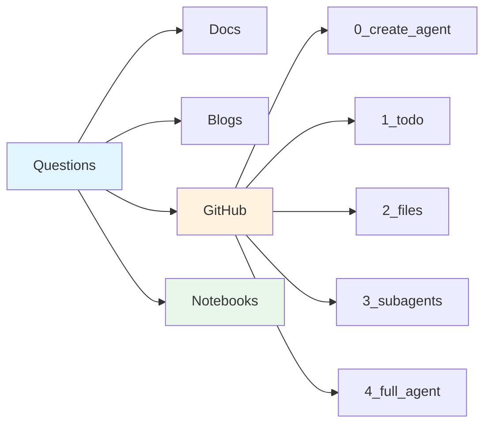

### Speaker Notes
The deep-agents-from-scratch repository provides hands-on notebooks that mirror this session's concepts. Work through them in order: baseline agent (0), then add planning (1), filesystem (2), subagents (3), and finally see the complete production agent (4). Each notebook builds on the previous one. Now, let's open it up for questions.

---

## Design System

### Colors
- Input/Query nodes: `#e1f5fe` (light blue)
- Processing/Model nodes: `#fff3e0` (light orange)
- Tool/Action nodes: `#e8f5e9` (light green)
- Output/Result nodes: `#fce4ec` (light pink)
- Neutral: `#f5f5f5` (light gray)

### Typography
- Titles: Bold, large
- Body: Regular
- Code: Monospace
- Quotes: Italic with attribution

### Diagram Conventions
- Flow: Left-to-right or top-to-bottom
- Subgraphs for grouped concepts
- Consistent node shapes per type

---

*Slides created for AIE9 Session 7: Deep Agents*
*Last updated: January 2026*
